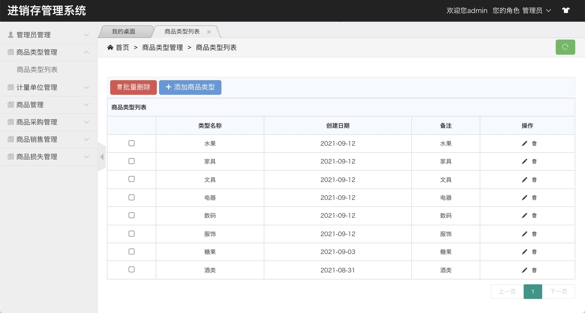
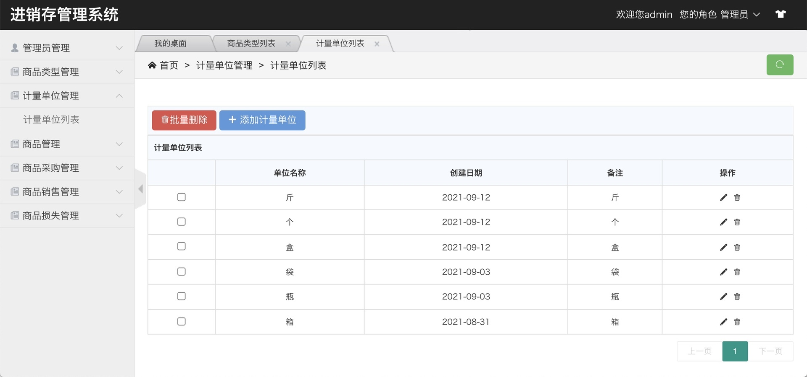
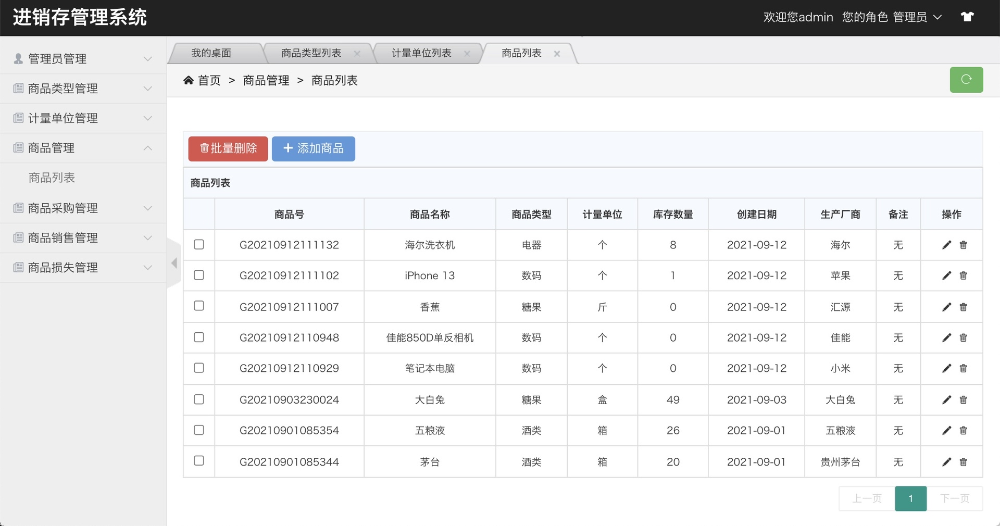
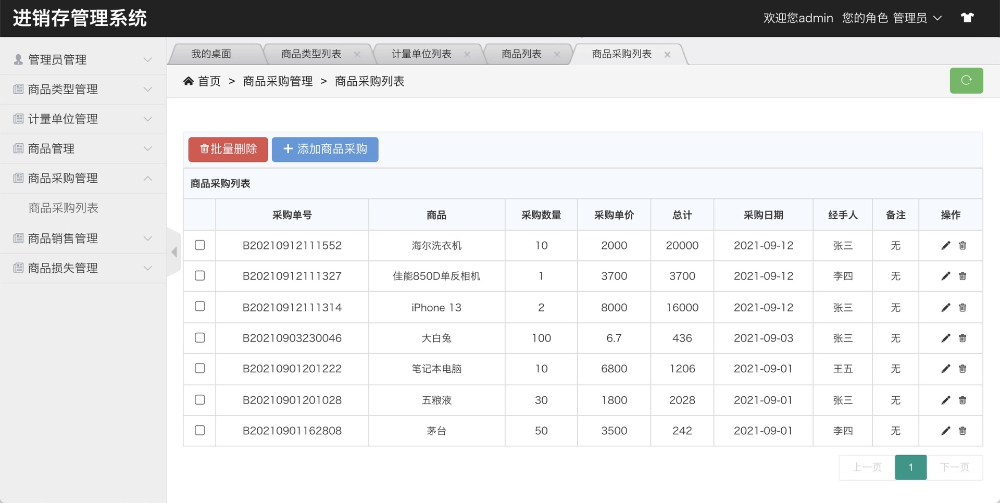
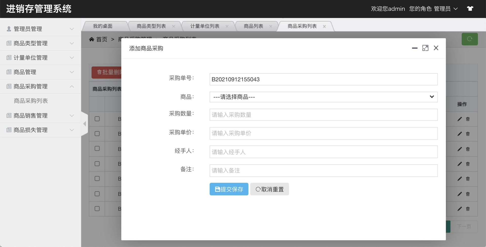
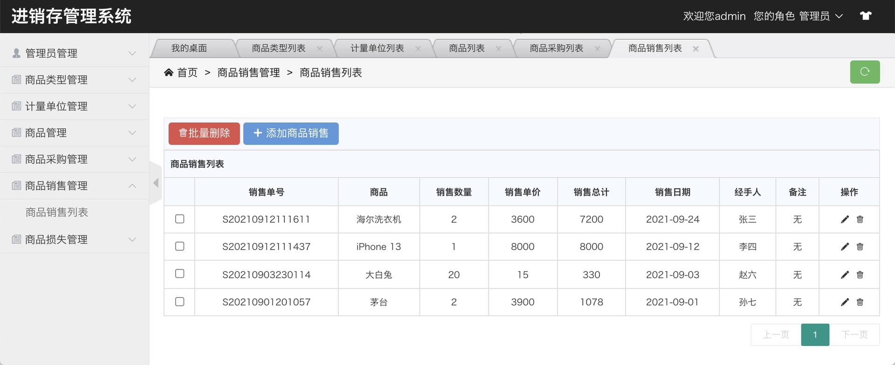
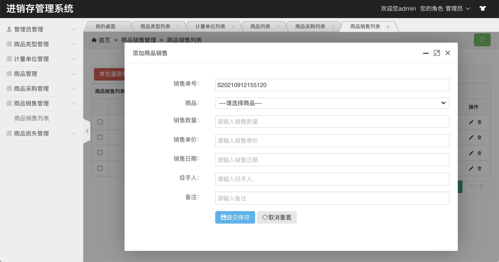
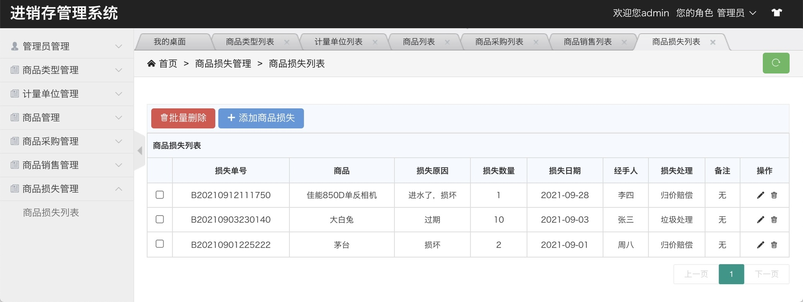

## 基于SSM实现的进销存管理系统

- <b>完整代码获取地址：从戎源码网 ([https://armycodes.com/](https://armycodes.com/))</b>
- <b>技术探讨、资料分享，请加QQ群：692619798</b> 
- <b>作者微信：19941326836  QQ：952045282</b> 
- <b>承接计算机毕业设计、Java毕业设计、Python毕业设计、深度学习、机器学习</b>
- <b>选题+开题报告+任务书+程序定制+安装调试+论文+答辩ppt 一条龙服务</b>
- <b>所有选题地址 ([https://github.com/YuLin-Coder/AllProjectCatalog](https://github.com/YuLin-Coder/AllProjectCatalog)) </b>

## 项目介绍
基于SSM实现的进销存管理系统,主要包含以下功能模块：
1.系统功能
系统登陆、修改密码、退出
2.管理员信息管理
管理员列表、添加管理员、修改管理员、删除管理员、批量删除等
3.商品类型管理
商品类型列表、添加商品类型、修改商品类型、删除商品类型、批量删除等
4.计量单位管理
计量单位列表、添加计量单位、修改计量单位、删除计量单位、批量删除等
5.商品信息管理
商品列表、添加商品、修改商品、删除商品、批量删除等
6.商品采购管理
商品采购列表、添加商品采购、修改商品采购、删除商品采购、批量删除等
7.商品销售管理
商品销售列表、添加商品销售、修改商品销售、删除商品销售、批量删除等
8.商品损失管理
商品损失列表、添加商品损失、修改商品损失、删除商品损失、批量删除等

## 项目技术
- 编程语言：Java
- 数据库：MySQL
- 前端技术：H-ui、Vue、Html
- 后端技术：Spring、SpringMVC、MyBatis

## 运行环境
- JDK版本：JDK1.8及以上
- 开发工具：IDEA、Ecplise、Myecplise都可以
- 数据库: MySQL5.7及以上

## 运行截图

